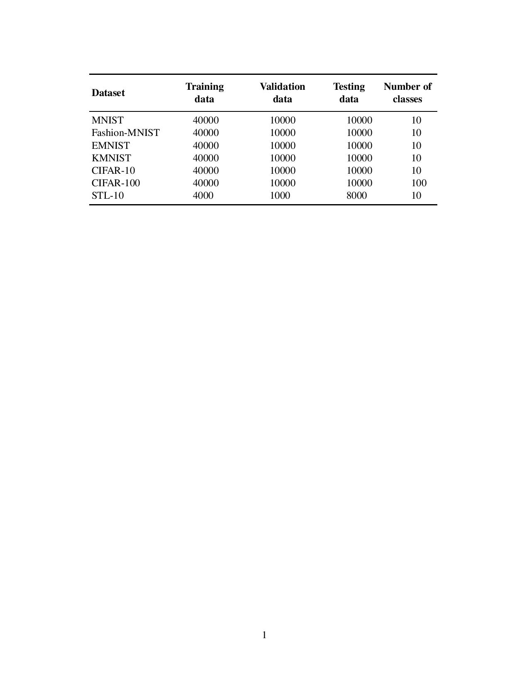
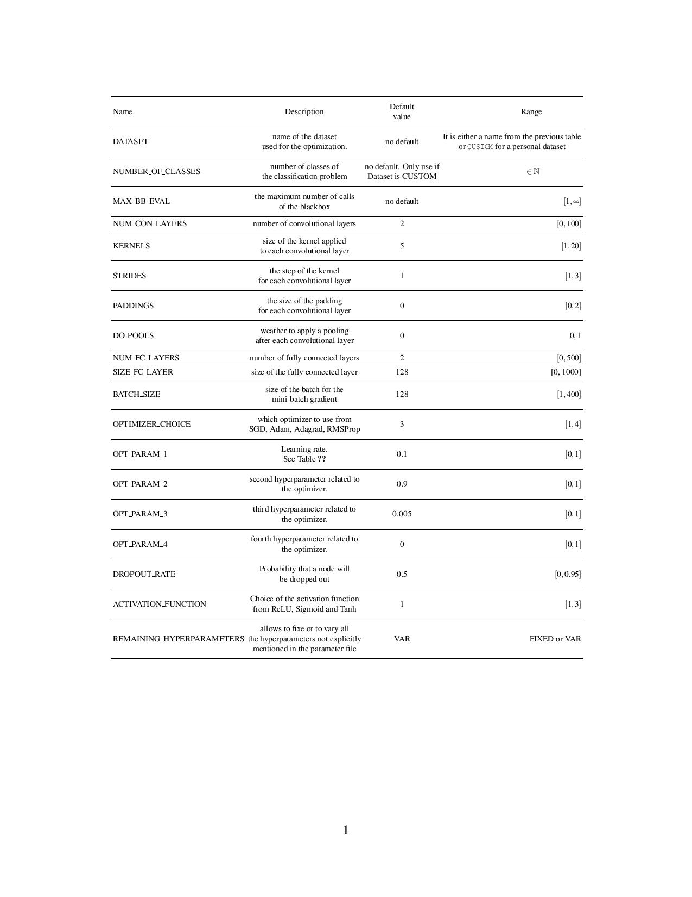

***************************
Basic usage
***************************

HYPERNOMAD is a library that aims at optimizing the hyperparameters of a deep neural  network for a given application.
Note that, at this stage, HYPERNOMAD is tailored for convolutional networks only.

In order to start an optimization, a few informations must be provided in order to specify the dataset used and optionnally some informations on the search space.
This is done in a parameter file which is passed as an argument to hypernomad.exe, as is shown in the following example:

.. code-block:: sh

    (path_to_bin)/hypernomad.exe parameter_file.txt
    
    
Choosing a dataset
=========================
    
The parameter file must contain some mandatory informations such as the name of the data set and the number of times the blackbox is called, 
which corresponds to the number of different configurations HYPERNOMAD is allowed to try. This package comes with the data sets
that are listed in the table below. 

HYPERNOMAD also offers the possibily of using a personnal data set in which case the user is 
responsible for providing the necessary informations to the blackbox. The necessary instructions to do so are provided in the Advanced usage section.

Specifying the search space
==============================

The user can choose to provide additionnal informations on the search space considered. HYPERNOMAD allows for a good flexibility of tuning a convolutional network
by considering multiple aspects of a network at once such as the architecture, the dropout rate, the choice of the optimizer and the hyperparameters related to the optimization aspect
(learning rate, weight decay, momentum, ...), the batch size, etc. The user can choose to optimize all these aspects or select a few and fixe the others to certain values. The user can also change
the default range of each hyperparameter. 

This information is passed through the parameter file by using a specific synthax:

.. code-block:: sh

  KEYWORD INITIAL_VALUE LOWER_BOUND UPPER_BOUND FIXED/VAR

This table lists all the possible keywords, their interpretation and the default values and ranges for each one

